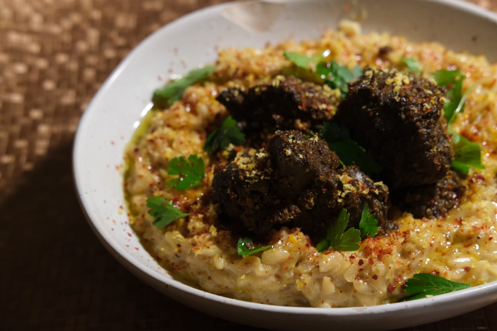

Rendang is a *dry* curry, and it's a labour of love. It's composed of a paste that you fry up (@sec-rendangpaste), an aromatic base called rempah tumis[^1] (@sec-rempahtumis), a tough cut of meat (beef chuck usually) (@sec-meat), a coconut milk / cream base (@sec-coconutmilk), with toppings and flavourings (@sec-flavourings) added towards the end to add extra depth to the dish. The trick here is to slow cook the beef and reduce of all liquid until you get caramelization. Conceptually simple, but the biggest thing here is consistent stirring to prevent burning at the bottom. The consistency you want to look for is a silky, dark brown paste, with meat that melts in your mouth. 

I'm presenting the recipe as provided to me by my mum, who's a wonderful cook. Over time, I've experimented with my personal tweaks here and there. ie: Substitutions, things closer to what I like, etc. Check out the footnotes at the end for my notes.

[^1]: *Rempah tumis* literally means fried or sauteed spices. The goal here is to achieve something called "pecah minyak" or breaking of the oil. More on this later.

# Ingredients

::: {layout-ncol=2}

## Rendang Paste {#sec-rendangpaste}

| **Ingredient**                              | **Amount** |
|---------------------------------------------|------------|
| Shallots                                    | 150g       |
| Lemon Grass                                 | 150g       |
| Garlic                                      | 6 Cloves   |
| Turmeric (Fresh) [^2]                       | 100g       |
| Dried Chillies (Seeded and Soaked in Water) | 10         |

## Rempah Tumis {#sec-rempahtumis}

| **Ingredient**      | **Amount** |
|---------------------|------------|
| Cloves              | 6 pcs      |
| Cinnamon            | 3 inches   |
| Star Anise          | 6 pcs      |
| Black Cardamom Pods | 5 pcs      |

:::
::: {layout-ncol=2}

## Meat & Marinade {#sec-meat}

| **Ingredient**       | **Amount**                |
|----------------------|---------------------------|
| Beef Chuck / Knuckle | 1kg, in bite sized chunks |
| Onion Powder         | 80g                       |
| Coriander Powder     | 60g                       |

## Coconut Milk Base {#sec-coconutmilk}

| **Ingredient**              | **Amount** |
|-----------------------------|------------|
| Thick Coconut Cream         | 0.5L       |
| Light Coconut Milk / Santan | 1.0L       |

:::

## Toppings and Flavourings {#sec-flavourings}

| **Ingredient**                      | **Amount**       |
|-------------------------------------|------------------|
| Salt, Sugar, MSG and Tamarind Juice | To Taste         |
| Kerisik [^3]                        | 200g             |
| (Optional) Turmeric Leaves          |                  |
| (Optional) Kaffir Lime Leaves       |                  |

    
[^2]: Fresh turmeric can be subbed out for ground turmeric at a 3:1 ratio (eg: 100g -\> 30g) in powder form ([Source](https://extension.colostate.edu/topic-areas/nutrition-food-safety-health/herbs-preserving-and-using-9-335/))

[^3]: Kerisik (toasted dessicated coconut) is a bit of a specialty ingredient. It's not mandatory but worth the time to make. Instructions are available here, and a good compromise is starting with dessicated coconut, and continuing on from Step 3 onwards: ([Link](https://extension.colostate.edu/topic-areas/nutrition-food-safety-health/herbs-preserving-and-using-9-335/))

# Recipe

::: callout-warning
Be prepared for a commitment when making rendang. It's a dry curry, where you're going low and slow on a tough cut of meat until all of the liquids evaporate, going from what begins as a braise into what I'd describe more akin to a fry. I'd set aside at least 3 - 4 hours to do this. The end product is definitely worth it, especially if you're cooking in bulk. Rendang lasts quite a while, especially when frozen.
:::

## Marinate Meat {#sec-marinatemeat}

1.  Marinate your beef in your dried spices (@sec-meat), preferably overnight (or at least 2 - 3 hours beforehand)

## Prepare the Rendang Paste and Rempah Tumis {#sec-preppaste}

2.  Blend (@sec-rendangpaste) together until you get a fine paste [^4].
3.  In a cast iron skillet, dutch oven, or wok, fry the paste in oil [^5] at low-medium heat until the paste and oil splits and separates. [^6].
4.  Add the dry spices (@sec-rempahtumis), and fry off in the paste until fragrant. You'll know when this is done, trust your nose.

[^4]: You want to make sure you have enough moisture for your paste to form. If you're finding trouble, make sure your solid pieces are cut down to size, and feel free to add water where necessary.

[^5]: Malaysian cooking is rarely exact, exchewing precision for intuition. Same thing goes for my mom's instructions! For our purposes, I usually eyeball around 50 - 80mls of oil. Just enough to fry off your paste in.

[^6]: This is known as *pecah minyak*. Some good discussion on how this happens [here](https://cooking.stackexchange.com/questions/10570/what-is-meant-by-cook-until-the-oil-separates-in-indian-curry-recipes)

## Add Beef & Slow Cook

5.  Add your marinated beef as done in (@sec-marinatemeat) and saute until you get some nice browning
6.  Add light coconut milk / santan (@sec-coconutmilk), tamarind juice, salt, and some palm sugar (or your sweetener of choice) (@sec-flavourings), and turn down the heat to a low-medium level, slow cooking until tender and stirring every so often to prevent the bottom from burning as the liquid reduces [^7]

## Finishing Touches

7.  As the color starts to turn dark brown (@fig-risotto), add the rest of the toppings: kerisik (toasted dessicated coconut), shredded turmeric and kaffir lime leaves from @sec-flavourings, and thick santan / coconut cream from @sec-coconutmilk
8.  Give the rendang a few last turns, and reduce further until it reaches your desired consistency (oily, slightly dry paste).
9.  You're done! Serve with steamed rice, or if you're being fancy, with a coconut based risotto (@fig-risotto).

{#fig-risotto .lightbox}

[^7]: This is the labour of love part coming in. Prepare for at least 1.5 hours worth of simmering, but you know when you're close to done once your beef collagen starts to break down and the meat turns tender. Make sure that you attend to the curry often, stirring to prevent burning. Eventually, you want the consistency to reach an oily paste texture, and the color to go from a light yellow / cream color to a dark (but not quite black) brown.